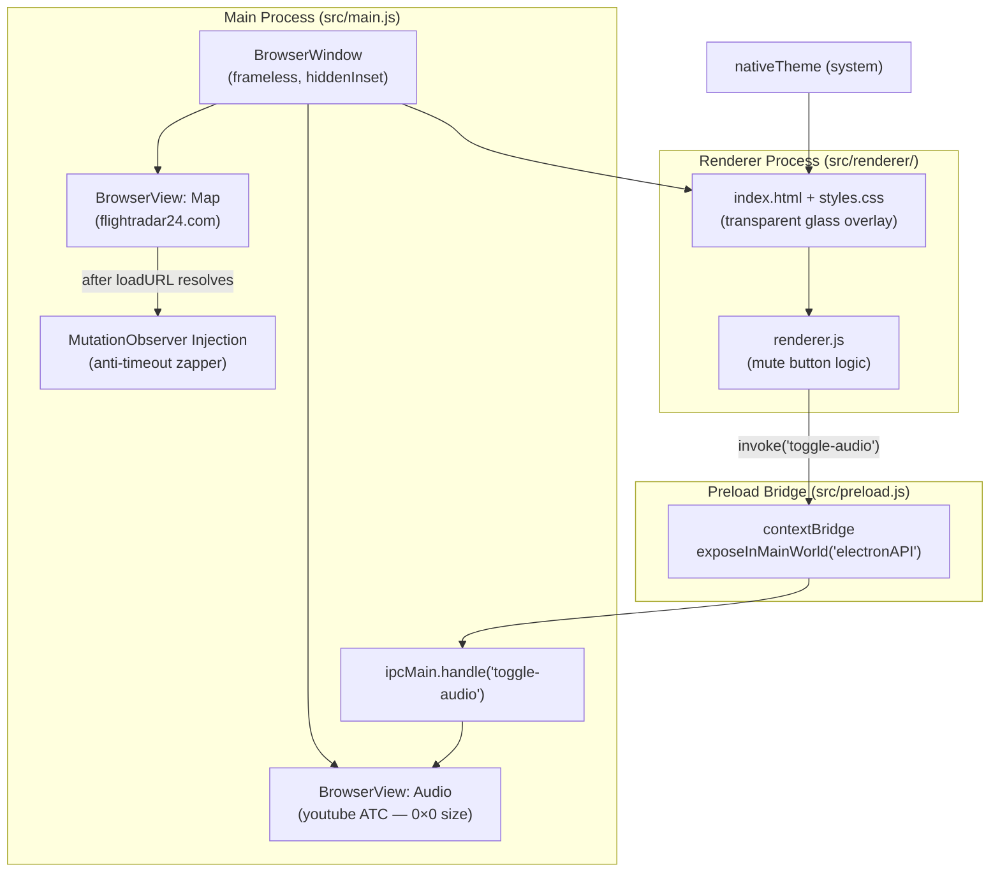

# Flight Control Tower

A lightweight macOS native-styled application leveraging Electron to display live FlightRadar24 tracking data, while simultaneously streaming background Air Traffic Control (ATC) audio without interruptions from subscription timeout modals.

## Features
- **Live Flight Tracking:** Displays the regional aviation map over Taiwan.
- **Continuous ATC Audio:** Streams the local ATC feed in a hidden background view.
- **UI Mute Controls:** Floating, glassmorphic UI toggle that effortlessly mutes/unmutes the background audio.
- **Day/Night Theme:** Automatically responds to the native macOS system preferences.
- **Anti-Timeout Zapper:** Automatically injects a `MutationObserver` that intercepts and destroys the FlightRadar24 30-minute session timeout modal, allowing for indefinite continuous monitoring.

## Architecture



## IPC Flow

| Direction | Event | Action |
|---|---|---|
| Renderer → Main | `invoke('toggle-audio')` | Reads + flips `webContents.isAudioMuted()` |
| Main → Renderer | return value (`boolean`) | Updates mute button icon and `.muted` CSS class |

## Getting Started

### Prerequisites
- Node.js > 18.x
- npm or yarn

### Installation
1. Clone the repository
2. Install dependencies:
   ```bash
   npm install
   ```

### Running the App
To start the app locally in development mode:
```bash
npm start
```

### Testing
To run the automated test suite (Jest unit tests + Playwright system tests):
```bash
npm test
```

> **Note:** The Playwright system tests (`test/system.spec.js`) require a live macOS GUI session — they launch the full Electron app and interact with real windows.

## Audio Source

ATC audio is streamed from a public YouTube Live feed (`youtube.com/watch?v=NOZVUBsCDEI`), loaded in a hidden zero-size `BrowserView` with `autoplayPolicy: 'no-user-gesture-required'` to allow playback without user interaction.
